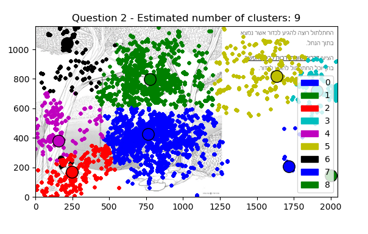
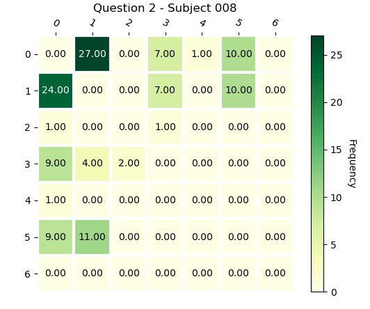
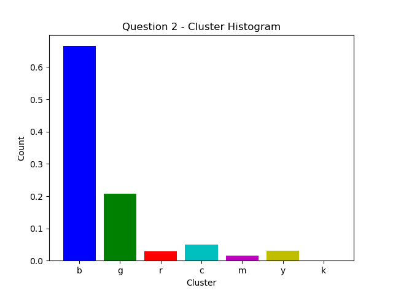

This is a guide on how to run the many analysis types of the project. For each analysis, we show a sample of the visualization outputted.  
  
  
  
#################################### Mean Shift Clustering #######################################  
In <MeanShift.py>:    
Given a radius, and a list of (x,y) points we will estimate the clustering of the data. (Areas of Interests - denoted AOI)  
  
Here is an example of Question 2 in our experiments:  

    
  
You can tweak the parameters as you like. The explanations are provided in comments within the file.  
  
################################### Cluster Neighboring Matrices #######################################  
  
In <MeanShift.py>:  
For each subject we calculate the number of times they switched from cluster A to cluster B (the clusters as were calculated in Mean Shift).  
In the matrix, the cell (i, j) means how many times the subject has shifted his look from area "i" to area "j".  
The numbers of i, j are shown in the figure above in Mean Shift.   
  
Here is an example of one:  
  
  
Note: In order to assist with visualization, the diagonal was set to 0 (people tend to move within the same area a lot). Otherwise, you'd have a really strong green in the  
diagonal line and pretty weak green everywhere else in the matrix.  
    
################################## Cluster Histogram ########################################  
  
In <MeanShift.py>:  
This is a general Histogram - for each area it will show how many points (in percentages) fall within the same cluster.  
The color codes within the histogram are the same as the one in the Mean Shift Clustering.  
  
Here is an example of one for Question 2:  
  
  
##################################### Notes #################################################  
  
There are many tweakable parameters within this file (<MeanShift.py>). They are all explained well within the file.  
For example, you are able to control the radius (bandwidth) for each question in the "Mean Shift Clustering" which will in turn change the visualization  
in the Histogram as well as Cluster Neighboring Matrix.  
  
Taking a quick read of the file should guide you to tweak as necessary.  
#####################################################################################  
#####################################################################################  
  
  
############################# HeatMap Generation ########################################  
  
In <Heatmap/heatmappy/HeatMapGenerator.py>:  
We produce heatmap over fixed interval timestamps - the result is a video which jumps every 'interval' seconds.  
  
A sample video can be shown here (You will need to download):  
[![Watch the video]](https://github.com/Elie-1996/CHBLab-Analyzing-MATH-Problem-Solving/blob/master/github_examples/Interval-HeatMap-Question-2-Subject-003.mp4)  
  
  
You have to select which question you would like to generate the map to. (Parameter QUESTION_IDX at top)  
  
############################# Scan Path Animation #####################################  
  
In <ScanPath/Scanpath.py>:  
We produce a fixation animation (a graph that is generated in real time that visualizes where the subject looks at any given moment).  
You have two modes:  
1) A run that includes bins: The entire image is divided into uniform HORIZONTAL_BINS x VERTICAL_BINS and any point that falls within a certain  
bin will be considered in the center of the bin. This makes for easier visualization of the messy data.  
2) A run that shows the exact (x, y) coordinates recorded in the raw data.  
  
Here is a gif with a 9x9 bins:  
  
Disclaimer: The colors of the arrows have no meaning, other than to ease visualization.  
    
In order to choose run (1) - simply choose legal positive integer values for  HORIZONTAL_BINS, VERTICAL_BINS.  
In order to choose run (2) - simple choose non-positive values for HORIZONTAL_BINS, VERTICAL_BINS.  
  
-> You can even choose whether to save the animation as a gif by setting SHOULD_SAVE_GIF=True.  
  
There are more parameters that are self-explanatory within the file.  
  
  
############################# Calibration Analysis ####################################  
  
In <CalibrationAnalysis/> folder:  
You have analysis for accuracy for 3 subjects.  
  
  
############################# General Notes ###########################################  
  
Please note that the base information/data needed or assumed can be found in <Utils.py>  
Explanations are provided within the file.  
  
  
  
  
  
  
  
  
